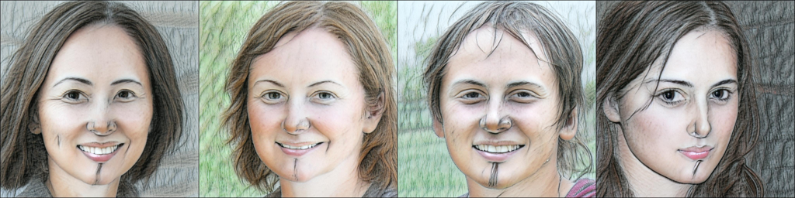

# StyleGAN-NADA: CLIP-Guided Domain Adaptation of Image Generators

StyleGan-NADA allows to adapt the domain of a StyleGan2 generator to a new domain. It does so by minimizing the directional clip loss:

where E_T and E_I are the text and image encoders that the CLIP model provides. G_train is the new generator that StyleGan-NADA produces while G_frozen is the original generator that is kept witohut training. 

For more details, the original paper is avaiable [here](https://arxiv.org/pdf/2108.00946.pdf)

# Run and train the network

To train and run the newly generated network, a public accessible colab is avaiable [here](https://colab.research.google.com/drive/1peXflahU89q9HM1_CF96JxcdslCn30W3?authuser=2#scrollTo=dWGWU6HtI8F5). It allows to select a model to adapt, insert source and target domains, train the network and use it to generate an arbitrary number of images. 

# Experiments and comparision

Some details of the implementation  where changed. Here we present some results and comparision with the original model. 

## a photo of a dog -> a photo of a cute baby dog
## ~200 iterations
Starting: 
Original: 
Ours: 

## a photo of a dog -> a drawing of a dog
## ~200 iterations
Starting: 
Original: 
Ours: 

## a photo of a dog -> a photo of joker
## ~200 iterations
Starting: 
Original: 
Ours: 

## a photo of a church -> a church painted by van gogh
## ~300 iterations
Starting: 
Original: 
Ours: 

## a photo of a church -> a cubism painting of a church
## ~400 iterations 
> (Note less artifcts!)

Starting: 
Original: 
Ours: 

## a photo of a person -> a drawing of a person
## ~200 iterations
> (Note less artifcts!)

Starting: 
Original: 
Ours: 

